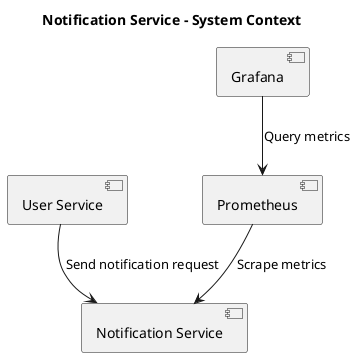

# High Level Design (HLD)

## 1 Document Information

|Item|Value|
|---|---|
|Project|Notification Service|
|Author|HaiNh|
|Version|1.0|
|Status|Draft|

---

# 2. Overview

Tài liệu mô tả kiến trúc tổng thể của `Notification Service`.

Mục tiêu:

- Mô tả các thành phần chính.
    
- Mô tả notification flow.
    
- Làm cơ sở cho LLD và implementation.
    

---

# 3. System Context



---

# 4. Architecture Overview

Notification Service gồm các thành phần chính:

- REST API
    
- Application Service
    
- Notification Sender
    
- Logging
    
- Metrics
    

Architecture:

```text
User Service
     |
     | HTTP
     v
Notification API
     |
     v
Application Service
     |
     v
Notification Sender
     |
     v
Log Notification
```

Trong Phase 1, hệ thống chưa gửi email thực tế.

Việc gửi notification được mô phỏng bằng application log.

---

# 5. Component Design

## 1 API Layer

Trách nhiệm:

- Nhận HTTP request.
    
- Validate request.
    
- Chuyển request sang Application Layer.
    
- Trả HTTP response.
    

---

## 2 Application Layer

Trách nhiệm:

- Điều phối notification flow.
    
- Xử lý business rule.
    
- Xác định notification cần gửi.
    
- Gọi `NotificationSender`.
    

---

## 3 Notification Sender

Trách nhiệm:

- Thực hiện gửi notification.
    

Phase 1:

```text
NotificationSender
       |
       v
LogNotificationSender
```

Notification được ghi ra application log thay vì gửi email thực tế.

Trong tương lai có thể bổ sung:

```text
NotificationSender
       |
       +--> EmailNotificationSender
       +--> SmsNotificationSender
       +--> PushNotificationSender
```

---

# 6. Notification Flow

```text
User Service
     |
     v
POST /notifications
     |
     v
Validate Request
     |
     v
Application Service
     |
     v
Build Notification
     |
     v
Notification Sender
     |
     v
Write Log
     |
     v
Return Response
```

---

# 7. State and Transaction

Phase 1:

- Không sử dụng database.
    
- Không lưu notification state.
    
- Không có database transaction.
    
- Notification được xử lý trong phạm vi HTTP request.
    

Do chưa có persistence nên Phase 1 chưa đảm bảo:

- durability;
    
- retry sau application crash;
    
- durable idempotency.
    

Các yêu cầu này sẽ được bổ sung ở phase sau.

---

# 8. Error Handling

Các lỗi chính:

|Error|Response|
|---|---|
|Request không hợp lệ|`400 Bad Request`|
|Notification type không hỗ trợ|`400 Bad Request`|
|Lỗi hệ thống|`500 Internal Server Error`|

Các lỗi phải được ghi log để phục vụ troubleshooting.

Failure của Notification Service không được làm rollback registration đã thành công tại User Service.

---

# 9. Scalability

Application được thiết kế stateless.

Có thể chạy nhiều instance phía sau Load Balancer:

```text
             Load Balancer
              /        \
             v          v
        Instance 1   Instance 2
```

Application instance không lưu business state quan trọng trong local memory.

---

# 10. Security

Phase 1:

- Authentication: Out of scope.
    
- Authorization: Out of scope.
    

Future:

- Service-to-service authentication.
    
- Chỉ trusted service được phép tạo notification.
    

---

# 11. Observability

## 1 Logging

Log các sự kiện:

- Notification received.
    
- Notification processing.
    
- Notification sent successfully.
    
- Notification failed.
    

Log nên có:

- `eventId`
    
- `notificationType`
    
- `traceId`
    

## 2 Metrics

Thu thập tối thiểu:

- request count;
    
- request latency;
    
- error rate;
    
- notification received count;
    
- notification sent count;
    
- notification failed count.
    

Monitoring stack:

- Prometheus
    
- Grafana
    
- OpenTelemetry
    

---

# 12. Deployment

Phase 1:

```text
User Service
     |
     v
Notification Service
     |
     +----> Application Log
     |
     +----> Prometheus
                |
                v
             Grafana
```

Local environment sử dụng Docker Compose.

---

# 13. Future Architecture

Trong phase sau có thể bổ sung:

- MySQL;
    
- Kafka;
    
- retry;
    
- idempotency;
    
- notification state;
    
- external Email Provider.
    

Architecture dự kiến:

```text
User Service
     |
     v
Notification Service
     |
     v
Kafka
     |
     v
Notification Worker
     |
     +----> MySQL
     |
     v
Email Provider
```

Chi tiết sẽ được quyết định ở phase tiếp theo.