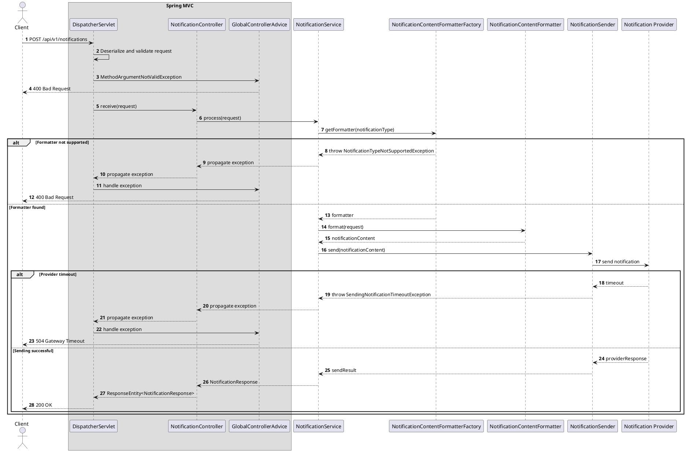

## 1 Overview
Tài liệu này mô tả thiết kế chi tiết (Low-Level Design) của dự án **Notification Service**, bao gồm các quyết định thiết kế và cách triển khai từng thành phần của hệ thống.

**Mục tiêu của tài liệu:**

- Xác định phạm vi (Scope) và ngoài phạm vi (Non-scope) của hệ thống.
    
- Mô tả các yêu cầu chức năng (Functional Requirements) của hệ thống.
    
- Trình bày Domain Model, bao gồm các thực thể và mối quan hệ giữa chúng.
    
- Mô tả chi tiết thiết kế và cách triển khai của từng tính năng.
    
- Làm rõ các quyết định thiết kế liên quan đến transaction, concurrency, database, xử lý lỗi và kiểm thử.
## 2 Scope / Non-scope

### 2.1 Scope

Phase hiện tại của Notification Service hỗ trợ:

- Nhận yêu cầu gửi notification thông qua REST API.
- Validate cấu trúc và dữ liệu của request.
- Hỗ trợ notification type `WELCOME_EMAIL`.
- Chọn `NotificationContentFormatter` tương ứng với notification type.
- Tạo nội dung notification từ request.
- Gửi notification thông qua `NotificationSender`.
- Trả kết quả xử lý đồng bộ cho caller.
- Chuẩn hóa error response bằng `GlobalControllerAdvice`.
- Ghi structured log cùng `eventId`, `traceId` và kết quả xử lý.
- Thu thập metrics về số lượng request, latency và lỗi gửi notification.

### 2.2 Non-scope

Các chức năng sau chưa thuộc phạm vi của phase hiện tại:

- Xử lý bất đồng bộ thông qua message broker.
- Retry khi gửi notification thất bại.
- Dead Letter Queue.
- Lưu lịch sử notification vào database.
- Idempotency hoặc deduplication theo `eventId`.
- Quản lý template động trong database.
- Hỗ trợ SMS, push notification hoặc nhiều email provider.
- Tracking trạng thái open, click hoặc delivery confirmation.
- Scheduled notification.


## 3 Core Requirements

## 4 Domain Model

### 4.1 Entity Relationship

Phase hiện tại không lưu notification vào database, do đó chưa có persistent entity hoặc Entity Relationship Diagram.

Các object đang tồn tại chỉ là DTO và application object:

- `NotificationRequest`: dữ liệu đầu vào.
- `NotificationResponse`: kết quả trả về caller.
- `NotificationType`: loại notification được hỗ trợ.
- `NotificationContent`: nội dung được tạo trước khi gửi.

### 4.2 State Machine

Phase hiện tại xử lý đồng bộ và không persist trạng thái notification. Trạng thái chỉ tồn tại trong thời gian xử lý request:

`RECEIVED → VALIDATED → FORMATTED → SENDING → SENT/FAILED`

State machine này chưa thể survive application crash và không hỗ trợ resume hoặc retry.
## 5 Feature:  Receive Notification Request
### 5.1 Responsibility
nhận request yêu cầu tạo notification từ service khác 
### 5.2 API / Entry Point

```http

POST /api/v1/notifications

```


### 5.3 Class Diagram
```plantuml
@startuml  
  
left to right direction  
  
package controller {  
    class NotificationController {  
        +receive(request: NotificationRequest): ResponseEntity<ApiResponse<NotificationResponse>>  
    }  
}  
  
package service {  
    class NotificationService {  
        +process(request: NotificationRequest): NotificationResponse  
    }  
  
    interface NotificationSender {  
        +send(recipient: String, content: String): void  
    }  
}  
  
package component {  
  
    interface NotificationContentFormatter {  
        +format(request: NotificationRequest): String  
    }  
  
    class NotificationContentFormatterFactory {  
        +get(type: NotificationType): NotificationContentFormatter  
    }  
  
    class WelcomeNotificationFormatter {  
        +format(request: NotificationRequest): String  
    }  
  
    class LogNotificationSender {  
        +send(recipient: String, content: String): void  
    }  
}  
  
package dto {  
  
    record NotificationResponse {  
        -eventId: UUID  
    }  
  
    record NotificationRequest {  
        -eventId: UUID  
        -notificationType: NotificationType  
        -emailAddress: String  
        -username: String  
    }  
  
    enum NotificationType {  
        WELCOME_EMAIL  
    }  
}  
  
NotificationController --> NotificationService  
  
NotificationService --> NotificationContentFormatterFactory  
NotificationService --> NotificationSender  
  
NotificationContentFormatterFactory --> NotificationContentFormatter  
  
WelcomeNotificationFormatter ..|> NotificationContentFormatter  
LogNotificationSender ..|> NotificationSender  
  
  
  
@enduml
```

### 5.4 Sequence Flow


### 5.5 Validation Rules

#### 5.5.1 Event ID Required

- `eventId` không được null.
- `eventId` phải là UUID hợp lệ.
- Trong phase hiện tại, `eventId` được sử dụng để correlation giữa các service.
- `eventId` chưa được sử dụng để deduplicate request.

#### 5.5.2 Notification Type Required and Supported

- `notificationType` không được null.
- Giá trị phải ánh xạ được sang `NotificationType`.
- Phase hiện tại chỉ hỗ trợ `WELCOME_EMAIL`.
- Giá trị enum không hợp lệ bị từ chối trong bước deserialize request.
- Notification type hợp lệ nhưng chưa có formatter sẽ phát sinh `NotificationTypeNotSupportedException`.

#### 5.5.3 Email Address Required

- `emailAddress` không được null hoặc blank.
- Giá trị phải đúng định dạng email.
- Email address phải được mask khi ghi log.

#### 5.5.4 Username Required

- `username` không được null hoặc blank.
- Username được sử dụng để tạo nội dung welcome email.

```java

public record NotificationRequest(
        @NotNull
        UUID eventId,

        @NotNull
        NotificationType notificationType,

        @NotBlank
        @Email
        String emailAddress,

        @NotBlank
        String username
) {
}
```


### 5.6 Error Handling
| Case                            | Message                              | HTTP Status | Exception                               | Error Code                        |
| ------------------------------- | ------------------------------------ | ----------: | --------------------------------------- | --------------------------------- |
| Missing event ID                | `Event ID must not be null`          |         400 | `MethodArgumentNotValidException`       | `EVENT_ID_MISSING`                |
| Missing notification type       | `Notification type must not be null` |         400 | `MethodArgumentNotValidException`       | `NOTIFICATION_TYPE_MISSING`       |
| Invalid notification type       | `Invalid notification type`          |         400 | `HttpMessageNotReadableException`       | `NOTIFICATION_TYPE_INVALID`       |
| Notification type not supported | `Notification type is not supported` |         400 | `NotificationTypeNotSupportedException` | `NOTIFICATION_TYPE_NOT_SUPPORTED` |
| Missing email address           | `Email address must not be blank`    |         400 | `MethodArgumentNotValidException`       | `EMAIL_ADDRESS_MISSING`           |
| Invalid email address           | `Email address is invalid`           |         400 | `MethodArgumentNotValidException`       | `EMAIL_ADDRESS_INVALID`           |
| Missing username                | `Username must not be blank`         |         400 | `MethodArgumentNotValidException`       | `USERNAME_MISSING`                |
| Notification provider timeout   | `Notification provider timed out`    |         504 | `SendingNotificationTimeoutException`   | `NOTIFICATION_PROVIDER_TIMEOUT`   |
| Unexpected error                | `Internal server error`              |         500 | `Exception`                             | `INTERNAL_SERVER_ERROR`           |
### 5.7 Test Cases

#### Controller tests

1. Request hợp lệ trả về `200 OK`.
2. Thiếu `eventId` trả về `400 Bad Request`.
3. Thiếu `notificationType` trả về `400 Bad Request`.
4. Notification type không ánh xạ được sang enum trả về `400 Bad Request`.
5. Email address bị thiếu trả về `400 Bad Request`.
6. Email address sai định dạng trả về `400 Bad Request`.
7. Username bị thiếu trả về `400 Bad Request`.
8. Provider timeout trả về `504 Gateway Timeout`.
9. Unexpected exception trả về `500 Internal Server Error`.

#### Service tests

1. Service yêu cầu factory trả đúng formatter.
2. Service truyền request cho formatter.
3. Service truyền đúng recipient và content cho sender.
4. Service trả về response chứa đúng `eventId`.
5. Formatter không tồn tại thì không gọi sender.
6. Sender phát sinh exception thì service propagate exception.

#### Component tests

1. Factory trả `WelcomeNotificationFormatter` cho `WELCOME_EMAIL`.
2. Factory ném exception khi không tìm thấy formatter.
3. Welcome formatter tạo đúng nội dung.
4. Log sender hoạt động trong local profile.

## 6 Observability
### 6.1 Logging
### 6.2 Metrics
### 6.3 Alerting

## 7 Design Decisions / Trade-offs

### 7.1 Synchronous Processing

Phase hiện tại xử lý request đồng bộ để giảm độ phức tạp khi triển khai.

Trade-off:

- Dễ phát triển, debug và kiểm thử.
- Caller phải chờ provider hoàn tất.
- Latency và availability của API phụ thuộc trực tiếp vào provider.
- Chưa hỗ trợ retry và recovery sau khi application crash.

### 7.2 Formatter Strategy and Factory

Mỗi notification type có một `NotificationContentFormatter` riêng. Factory chịu trách nhiệm chọn formatter phù hợp.

Trade-off:

- Dễ bổ sung notification type mới.
- Tránh `if/else` hoặc `switch` lớn trong service.
- Cần quản lý mapping giữa `NotificationType` và formatter.

### 7.3 NotificationSender Abstraction

Business service phụ thuộc vào interface `NotificationSender` thay vì implementation cụ thể.

Trade-off:

- Có thể thay `LogNotificationSender` bằng `EmailNotificationSender`.
- Dễ mock trong unit test.
- Cần cấu hình bean theo environment hoặc profile.

### 7.4 No Persistence

Phase hiện tại không lưu notification vào database.

Trade-off:

- Implementation đơn giản.
- Không thể truy vấn lịch sử gửi.
- Không hỗ trợ deduplication.
- Không thể retry hoặc resume sau khi service crash.

### 7.5 Generic Request DTO

Phase hiện tại sử dụng một request DTO chứa các field dành cho `WELCOME_EMAIL`.

Trade-off:

- Đơn giản khi chỉ có một notification type.
- DTO sẽ phình to khi bổ sung nhiều loại notification.
- Phase sau nên cân nhắc payload riêng theo từng notification type.


